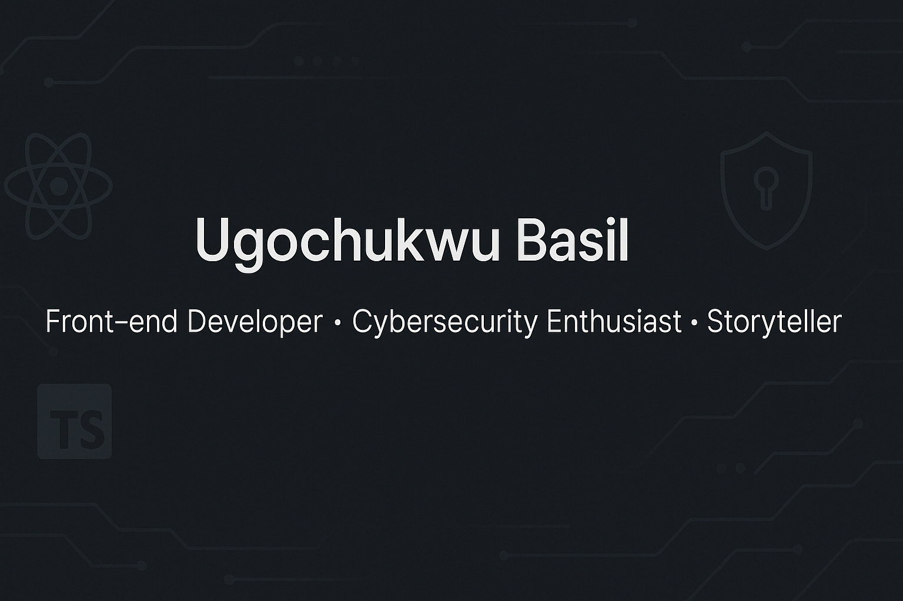

<!-- Banner -->
<!-- 

  

 -->

<h1 align="center">
 Hey, I’m Ugochukwu
</h1>

  <em>Front-end developer • Cybersecurity enthusiast • Storyteller</em>  

Passionate about building responsive, performant, and accessible web experiences using **React**, **Next.js**, **TypeScript**, and **TailwindCSS**.

I enjoy designing with systems in mind—whether it’s UI architecture, application state, or secure flows. My projects are practical, user-focused, and built with scalability in mind.

Currently exploring how great interfaces meet strong security.

> _“Great software should feel invisible—secure, seamless, and built for humans.”_  
> — Ugochukwu

---

## 🧠 About Me

Ugochukwu Basil is a front-end developer who cares deeply about detail, performance, and building interfaces that feel as good as they look.  
He combines a sharp eye for design with a structured approach to development, using tools like **React**, **Next.js**, **TypeScript**, and **TailwindCSS** to bring products to life.

He’s also a **cybersecurity enthusiast**, regularly studying how frontend applications interact with the web securely—especially how to prevent common vulnerabilities while maintaining usability.  
When he’s not coding, he’s crafting stories—both through clean UI and written word.

### 🔍 What I Love Doing

- Architect reusable components and clean design systems
- Build tools that simplify workflows or solve real user problems
- Explore how security and frontend best practices intersect
- Collaborate with others on creative and meaningful projects

---

## 🌟 Featured Projects

| Project                                                                                                                                                                                                                                                                                                                                                                                                                                                             | Description                                                                                          |
| ------------------------------------------------------------------------------------------------------------------------------------------------------------------------------------------------------------------------------------------------------------------------------------------------------------------------------------------------------------------------------------------------------------------------------------------------------------------- | ---------------------------------------------------------------------------------------------------- |
| [**SaveStreak**](https://savestreakbyhim.vercel.app)    | Gamified personal savings tracker that motivates users with streaks, color states, and offline sync. |
| [**PulseCheck**](https://pulsecheckbyhim.vercel.app)   | Mental health & productivity tracker that visualizes emotional trends and daily focus patterns.      |
| [**AutoCV**](https://autocvbyhim.vercel.app)                   | Minimalist resume builder that generates sleek, professional CVs from structured user input.         |
| [**Cyber Attack Detector**](https://ieeexplore.ieee.org/document/10124506)                                                                                                | Academic project — Hybrid CNN-MLP model detecting anomalies in network traffic (95% accuracy).       |

<!--
| [**StreamR**](https://github.com/thebasilugo/streamr) | A real-time movie streaming platform powered by Firebase authentication and media reviews. |
| [**CheckpointRide**](https://github.com/thebasilugo/checkpointride) | Route and logistics planner with mapping features and scheduling UI. |
| [**KicksConfetti**](https://github.com/thebasilugo/kicksconfetti) | E-commerce app built for sneaker drops with secure payments and advanced filtering. |
| [**TaskFlow**](https://github.com/thebasilugo/taskflow) | Project/task manager with real-time updates and drag-and-drop support. |
-->

---

## 🛠 Tech & Tools

**Languages**  
JavaScript • TypeScript • HTML5 • CSS3 • Python

**Frameworks & Libraries**  
React • Next.js • TailwindCSS • Firebase • Firestore • Bootstrap • Material UI

**Tools & Platforms**  
VS Code • Git/GitHub • Figma • CapCut • Canva • REST APIs

**Learning**  
Secure front-end architecture • Node.js • Advanced React patterns

---

## 🎓 Academic Background

**BSc. Computer Science** – Landmark University  
Published Research: _Intrusion Detection Systems Using ML_ – [IEEE Xplore](https://ieeexplore.ieee.org/document/10124506)

---

## 📬 Let’s Connect

I’m always open to:

- Front-end development challenges
- Secure web design and accessibility
- Teaching/mentorship opportunities
- Collaborative project building

Don't be a stranger, Reach out!  
[Email](mailto:basilugo2@gmail.com) | [LinkedIn](https://linkedin.com/in/thebasilugo) | [Portfolio](https://thebasilugo.github.io/) | [Twitter](https://twitter.com/thebasilugo) | [Instagram](https://instagram.com/thebasilugo)

---

<!--
## 📈 GitHub Stats

  
  

---

## 🟩 GitHub Contribution Heatmap

  

---

## 🖼️ Personal Banner

  

-->
